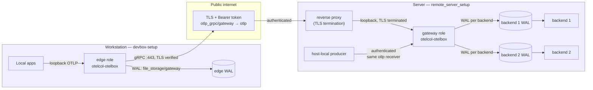

# Adopting `otelcol-otelbox` in the consuming repositories

This document is the handover for the one piece of work this repository does
not do itself: getting `remote_server_setup` and `devbox-setup` off their
pre-split arrangements and onto this artefact. Both halves are now written and
uncommitted in their own repositories. It is written for a session with none of
the context that produced it — it states reasoning, not just steps, and where a
consuming repository's own procedure is involved it names the file and stops,
per the scope boundary in `AGENTS.md`: this repository owns the artefact and
the shared configuration layer, not the deployment.

## State at the time of writing

`v1.0.0` is published. The release carries both binaries and their `.sha256`
files, `otelcol-otelbox_config.tar.gz`, and `image-digest.txt` holding
`ghcr.io/abrosimov/otelcol-otelbox@sha256:e15a4965689ea6f40ff91b8ff4d341db26ca5a7172a12d6726617b1b297dd98d`.
`Formula/otelcol-otelbox.rb` was rewritten by CI and carries the published
checksums of the two assets it installs — the `darwin/arm64` binary and the
configuration bundle — so no `PENDING-FIRST-CI-PUBLISH` placeholders remain.

**`2.0.0` is declared in `builder.yaml` and not yet released.** The number is
settled and the major is deliberate — see `AGENTS.md` "Version and release
flow". Steps one and two below describe the 1.0.0 adoption and stand as written;
step three is new and depends on the next release existing. Read every pinned
version and digest in this document as a record of what was current when it was
written, not as a value to copy — see the warning in step one.

**One thing has changed under this whole document.** The reference profiles are
no longer maintained as mirrors of the deployed copies (`AGENTS.md`, "The
reference profiles are demonstrations, not mirrors"). Where a step below says
"read it against `config/examples/…` side by side", that is still the right
thing to do for the *shape* — pipeline order, processor set, queue and WAL
structure — but a literal difference in an endpoint, a component instance name
or a credential path is now expected rather than a defect. In particular the
gateway's exporters and WALs are now named `backend_1` and `backend_2` here,
and the deployed copy is free to keep its own names.

**And three things that are not a matter of taste.** They are why 2.0.0 is a
major, and each has to land in the same change as the binary upgrade rather than
after it.

1. **`health_check` is unlinked**; all three roles moved to `healthcheckv2`. A
   deployed role layer still naming it will not drift quietly — the collector
   refuses to load an unknown extension type. Three consequences: the type
   becomes `healthcheckv2` and needs `use_v2: true` beside it; the served path
   moves from `/` to `/status`, so any probe, `curl`, readiness check or monitor
   pointed at the old one starts getting 404; and the bind address is now
   `${env:OTELBOX_<ROLE>_HEALTH_ENDPOINT}`, a variable the supervisor has to
   render. `config/examples/*.yaml` carry the full block, with the two traps
   (a bare `grpc:` key opens a port; without `use_v2` the v1 responder answers
   everything) commented at the point where they bite.
2. **The gateway has one OTLP receiver and one allowlist.** `otlp/public` and
   `otlp/local` are merged into `otlp` on 14319/14320; 14321/14322 are free and
   `OTELBOX_GATEWAY_LOCAL_TOKEN_FILE` no longer exists. Every host-local
   producer — the host agent, the reverse proxy — moves to the remaining
   listener with a token added to the single allowlist file. A receiver carries
   exactly one authenticator (`configauth.Config` holds one `AuthenticatorID`),
   so a deployment that genuinely wants two independent credential sets keeps
   two receivers of its own; the profile no longer demonstrates that, because
   the second set bought separation of revocation and nothing else.
3. **Every listener binds `${env:OTELBOX_<ROLE>_BIND_HOST}`**, port literal —
   three new variables, one per role, each a load error if unset. The port
   numbers are unchanged, so a deployment that renders the variable to whatever
   it binds today changes nothing else.

## Estate view

Trust boundary: the edge↔gateway leg is the one this repository can reason
about, because its credential is a bare bearer token in a header, so
verification stays on there, and the integration test mints a CA per run rather
than turning it off (see `AGENTS.md` "Conventions"). The gateway's one receiver
authenticates every request against its allowlist rather than relying on where
its socket is reachable from; whether the remaining legs — gateway to its
backends, host agent to the gateway — also carry transport security is the
deployment's decision, not this repository's. Every leg leaving a process,
authenticated or not, carries its own on-disk `file_storage` queue: one on the
edge, one per backend on the gateway. The remote and host-local arrows are drawn
separately because they come from different places, not because they land on
different receivers — they land on the same one, and share the same pipelines,
WALs and sending queues (see "Host-local ingest and infrastructure telemetry"
below).

## Order, and why

**The gateway goes first.** The asymmetry that decides it: break the gateway
and every edge keeps buffering into its own WAL and drains once the gateway
returns — the data survives. Break the edge and nothing buffers in front of
it at all; applications push straight into loopback, and whatever they sent
while the collector was down or misconfigured is gone. One side has a safety
net, the other does not.

Supporting reasons: the gateway is one machine under Ansible with a rollback
procedure already written
(`remote_server_setup/docs/runbooks/public-edge-and-telemetry-ingress.md`
§13), the edge is potentially several workstations; the gateway change is the
smaller of the two; and `devbox-setup` currently carries an entire duplicate
build pipeline that step two deletes, which is better done once the
receiving end is settled and not before.

The decisive reason is that **the server side of the authentication incident
was never diagnosed.** `AGENTS.md` "Known state" records what is and is not
known: the gateway's token-file format is not the cause — upstream's
`bearertokenauthextension` parses the file line by line and treats text after
the first whitespace as a comment, which is exactly what
`remote_server_setup` renders. The mismatch is in the credential value itself
or in which allowlist the running gateway actually has, and diagnosing that
needs server access. Doing the gateway work first is the occasion to settle
it, because the work necessarily touches the token file, the compose
definition and the running container. Doing the edge first means changing an
edge whose delivery may already be broken for an unknown reason, and then
debugging two problems — the adoption and the pre-existing incident — at
once, unable to tell which one produced a given symptom.

## Step one — `remote_server_setup`

**Done, uncommitted.** Kept as written because it states the reasoning behind
each edit, which the diff does not carry.

### What changes

- **`roles/otel_gateway/templates/compose.yaml.j2`** pins
  `otel/opentelemetry-collector-contrib:0.156.0` by tag. It becomes this
  repository's GHCR image, pinned by digest — not by tag, matching the
  practice `README.md` "Run the gateway from the image" describes. **Read the
  digest from `image-digest.txt` on the release for the version being
  adopted, not from "State at the time of writing" above**: that value is a
  record of what was current when this document was written, and a later
  release will have superseded it by the time this step is actually done —
  copying it verbatim would silently pin a stale image. The image is
  `scratch`: no shell, no baked-in configuration,
  every writable path arrives as a bind mount, so the volume list needs a
  second config file (the base layer) alongside the existing
  `./config.yaml:/etc/otelcol-contrib/config.yaml:ro` mount, and `command`
  needs two `--config` arguments instead of one.

- **`roles/otel_gateway/files/config.yaml`** is the authoritative gateway
  configuration and the thing that most needs care. Read it against
  `config/examples/gateway.yaml` side by side — they are already close, and
  the differences are exactly the ones adopting the base layer resolves:

  - `memory_limiter` (`check_interval: 5s`, `limit_mib: 512`,
    `spike_limit_mib: 128`) and `batch` (`send_batch_size: 8192`,
    `send_batch_max_size: 8192`, `timeout: 5s`) in the current file already
    carry the exact values the reference gateway profile restates over the
    base layer. No value changes; what changes is that these become
    deliberate overrides of a base layer that also exists, rather than the
    whole of the processor configuration. Because map keys merge key by key
    (`AGENTS.md` "Configuration layering"), every key in both blocks must
    stay restated — dropping one would silently pull in the base layer's
    workstation-sized value instead.
  - The backend exporters already use the canonical `otlp_grpc` type — this
    file does not carry the `otlp` → `otlp_grpc` rename that `devbox-setup`
    still needs; that piece of the "still outstanding" renames in `AGENTS.md`
    applies to the edge role only. Their *instance* names are this
    repository's business only inside `config/examples/gateway.yaml`, which now
    calls them `backend_1` and `backend_2`.
  - `redaction/secrets` is currently **absent** from this file and from every
    pipeline's processor list. This is the one substantive gap, not a
    renaming exercise: the running gateway redacts nothing today. Adopting
    the base layer adds the processor (via `config/base.yaml`, taking its
    patterns verbatim — do not restate `redaction/secrets` in the role
    layer, that is the whole point of the base layer existing) and every
    pipeline's processor list must add it between `memory_limiter` and
    `batch`, matching `config/examples/gateway.yaml`'s `pipelines:` block.
    This matters more here than it would on the edge, because the gateway
    accepts host-local telemetry — today, the reverse proxy's own traces — that
    never passed through an edge and so was never redacted anywhere upstream.
  - The per-backend `file_storage` `max_size` is
    currently `5368709120` (5 GiB) in this file against `10737418240`
    (10 GiB) in the reference profile, and `queue_size` is `500000` items
    against `9663676416` bytes with `sizer: bytes`. The reference profile's
    comments explain the reasoning (byte-sized queue matched to the storage
    cap, headroom for compaction, an agreed 20 GiB per-backend ceiling) —
    whether to bring the deployed values up to match, or to keep the smaller
    footprint deliberately, is this consuming repository's capacity
    decision, not a mechanical rename. State the choice rather than silently
    picking one.
  - `service::telemetry::metrics` is not present in the current file at all
    (it is set by CI/OCB defaults implicitly, or the contrib image's own
    default), whereas both the base layer and the gateway role layer state
    it explicitly — `level: detailed` on port `8889`. Confirm the currently
    running gateway's self-metrics port before cutting over so `curl
    127.0.0.1:8889/metrics`-based checks in the runbook and in
    `roles/otel_gateway/tasks/main.yml` do not silently start reading a
    dead port.

- **`roles/otel_gateway/tasks/main.yml`** — two tasks name the single-layer
  config path and must become two `--config` arguments:
  "Validate the selected gateway Collector configuration" (currently
  `validate --config=/etc/otelcol-contrib/config.yaml`) and any equivalent
  invocation the Compose `command` itself carries (see above). The rest of
  the role — the Vault-backed assertions, the directory creation, the
  Compose reconciliation, the loopback listener checks — is unaffected: none
  of it inspects the image or the config's internal shape.

### What does not change

The Compose deployment shape, host networking, the loopback bindings on
14319–14322/8889, the ingest token file and its `0400` mode, the backend
containers, `otel-gateway.env.j2`, `ingest.tokens.j2`, and the Ansible Vault
structure. None of those are this repository's concern and none of them need
to move for **this** adoption — 1.0.0's. 2.0.0 does move two of them: the
14321/14322 bindings go away with the second receiver, and the second token file
merges into the first (see "And three things that are not a matter of taste"
above).

## Step two — `devbox-setup`

### What changes

- **The duplicate build pipeline goes away.** `devbox-setup` currently builds
  its own OCB artefact under `otelcol-edge/` (`builder.yaml`, `README.md`,
  `smoke-check.sh`) via `.github/workflows/otelcol-edge.yml`, publishing
  `otelcol-edge-v<version>` releases in `devbox-setup` itself. Comparing
  component manifests: `otelcol-edge/builder.yaml` links 18 receivers, 8
  processors, 3 exporters, 7 extensions, 5 connectors (41 total, per its
  README); `otelcol-otelbox`'s `builder.yaml` links the identical set plus
  six — `prometheusreceiver` and `journaldreceiver`, `oidcauthextension` and
  `oauth2clientauthextension`, `groupbyattrsprocessor` and
  `cumulativetodeltaprocessor`. **Nothing devbox-setup currently links is
  missing from this artefact.** Adopting it is a pure consolidation, not a
  component
  reduction: every receiver, processor, exporter, extension and connector
  `otelcol-edge` builds today — including ones not yet wired into any
  pipeline, such as `hostmetricsreceiver`, `filelogreceiver`,
  `sqlqueryreceiver`, `transformprocessor`, `remotetapprocessor` and the
  `mcp` extension — is still available, dormant, in `otelcol-otelbox`.
  `.github/workflows/otelcol-edge.yml` and the `otelcol-edge/` directory are
  deleted once the swap below is made and proven.

- **`roles/devbox/tasks/darwin/install_otelcol_edge.yml`** currently resolves
  `dist.version` from `otelcol-edge/builder.yaml` (a file this task removes)
  and downloads
  `{{ devbox_packages.otelcol_edge.release_base }}/otelcol-edge-v{{ version
  }}/otelcol-edge_darwin_arm64` with a `.sha256` sidecar from the same
  release. Both need to point at this repository instead: `dist.version`
  reads from `builder.yaml`'s own manifest (fetched or vendored — this
  repository does not prescribe how a consumer pins a dependency on another
  repository's file), and the asset becomes
  `https://github.com/abrosimov/otelcol-otelbox/releases/download/v<version>/otelcol-otelbox_darwin_arm64`
  with its `.sha256`. `devbox_packages.otelcol_edge.release_base`
  (`roles/devbox/defaults/main/packages.yml:188`, currently
  `https://github.com/abrosimov/devbox-setup/releases/download`) needs to
  become `https://github.com/abrosimov/otelcol-otelbox/releases/download`,
  and `install_otelcol_edge.yml`'s asset-path construction (currently
  `{{ release_base }}/otelcol-edge-v{{ version }}/otelcol-edge_darwin_arm64`)
  needs to drop the `otelcol-edge-v<version>` release-name segment in favour
  of this repository's bare `v<version>` tag and `otelcol-otelbox_darwin_arm64`
  asset name.

- **Local binary and config paths are a naming choice, not a forced rename.**
  The install task currently deploys the binary to
  `~/.local/bin/otelcol-edge`, the config layers to
  `~/.config/otelcol-edge/{base.yaml,config.gateway.yaml}`, and supervises it
  under the LaunchAgent label `local.otelcol-edge`
  (`roles/devbox/templates/darwin/Library/LaunchAgents/local.otelcol-edge.plist.j2`).
  Nothing in this artefact requires those paths or that label to change —
  they are `devbox-setup`'s own convention, independent of which repository
  built the binary inside them. Whether to rename them to `otelcol-otelbox`
  for consistency with the upstream artefact name, or to keep the
  `otelcol-edge` label as this repository's chosen name for its edge
  deployment, is a decision for that repository to make and record; this
  document does not make it.

- **`roles/devbox/files/.config/otelcol-edge/base.yaml` and
  `config.gateway.yaml`** are, structurally, already the base and edge-role
  layers this repository defines — `base.yaml`'s `memory_limiter`
  (`1s`/`256`/`64`), `batch` (`5s`/`2048`/`4096`) and `redaction/secrets`
  patterns are byte-for-byte the values in `config/base.yaml`, and
  `config.gateway.yaml`'s exporter, WAL sizing and pipeline shape match
  `config/examples/edge.yaml`. The adoption is therefore not a rewrite of
  these files' content, only of two names inside them:
  **`resourcedetection` → `resource_detection`** (processor,
  `base.yaml:34`) and **`otlp` → `otlp_grpc`** (exporter,
  `config.gateway.yaml:30`, `otlp/gateway` → `otlp_grpc/gateway`, referenced
  again in the three pipelines' `exporters:` lists). `AGENTS.md` "Canonical
  component types" calls this out as one change, to be made here. The
  deprecated names still load, so this is not urgent on its own,
  but doing it while touching these files anyway avoids a second edit later.
  Whether these two files stay hand-maintained copies in `devbox-setup`, or
  are replaced by unpacking the release's `otelcol-otelbox_config.tar.gz`
  (or the formula's installed
  `$(brew --prefix otelcol-otelbox)/share/otelcol-otelbox/config`, though the
  formula is explicitly not the install path here — see below) is an open
  question; either keeps the values correct, and the choice affects only how
  a future upstream change to `config/base.yaml` propagates.

- **`make otelcol-edge-config` and `make otelcol-edge-test`**
  (`scripts/otelcol-edge-config.sh`, `scripts/otelcol-edge-test.sh`) read and
  write `~/.local/bin/otelcol-edge`, `~/.config/otelcol-edge/endpoint.env`,
  the keychain slot `otelbox-edge-token`, and the LaunchAgent label
  `local.otelcol-edge`. None of them reference the `otelcol-edge/` build
  pipeline or its release. **They survive unchanged** provided the local
  path and label naming choice above keeps those exact strings; they need
  updating only if that naming choice is to rename them to
  `otelcol-otelbox`-flavoured paths, in which case the edits are mechanical
  find-and-replace, not structural.

### State plainly: Homebrew is not the installation path here

Both `README.md` "Install on macOS" and the formula's own caveats say this,
and it is worth restating in this document because it is the fact most
likely to be silently violated by a future contributor reaching for the
familiar `brew install`: **on a workstation `devbox-setup` manages, Ansible
owns the binary.** It downloads the release asset, checks it against the
published digest, and installs it under `~/.local/bin/` for the launchd
agent to run — that is precisely what `install_otelcol_edge.yml` already
does and continues to do after this adoption, just pointed at a different
repository's release. Installing through Homebrew as well would put two
collectors on disk at two paths, free to drift to different versions, with
launchd going on running the one Homebrew did not install — so
`otelcol-otelbox --version` in a terminal could disagree with the version
actually collecting anything. The formula's audience is machines the
playbook does not manage, plus manual use; a `devbox-setup`-managed
workstation is neither.

## Step three — `remote_server_setup`'s `telemetry_source` role

**New in 2.0.0, and blocked on it being released.** The host-agent role already
exists in that repository and is deployed; what 2.0.0 changes is that the
collector it pins can finally carry the pieces the role had to defer. Six
edits, and `config/examples/host-agent.yaml` is the reference for all of them:

- **`telemetry_source_version`** and the `telemetry_source_architectures`
  checksum move to 2.0.0's published asset. The comment above that checksum
  explains why it is pinned here rather than fetched alongside the binary.
- **`telemetry_source_journal_enabled` becomes `true`.** Its current value is
  `false` for one stated reason — the pinned collector carries no journald
  receiver — and 2.0.0 removes it. The role also reads the components out of
  the installed binary and refuses to render the receiver unless it is
  genuinely there, so the gate stays honest either way.
- **The exporter moves to the gateway's one receiver.** `otlp/local` on
  14321/14322 is gone; the agent dials the remaining listener (conventionally
  `:14319`) and its credential becomes a line in the gateway's single allowlist
  file rather than one of its own. Two variables to render on this side:
  `OTELBOX_HOST_AGENT_BIND_HOST` for the self-metrics listener, and the changed
  `OTELBOX_HOST_AGENT_GATEWAY_ENDPOINT`.
- **The sending queue needs an explicit `batch:` block.** Omitting the key
  leaves no batcher at all, so the payload is unbounded in bytes and a large
  scrape can exceed the gateway's 32 MiB receive limit — a record over the
  sender's maximum is dropped by the sender, not split. The profile's values
  (`sizer: bytes`, `min_size` 1 MiB, `max_size` 8 MiB) keep the invariant
  `batch.max_size` < `max_recv_msg_size_mib` ≤ `max_request_body_size`.
- **A `file_storage` extension for the journald cursor**, named in the
  receiver's `storage:` key and added to `service::extensions`. This is the one
  substantive gap rather than a rename: without it the receiver gets a no-op
  persister whose `Get` returns nil, so no cursor exists and every `journalctl`
  respawn either loses records or replays the whole journal. It is a cursor,
  not a sending queue — the in-memory queue argument in the template stands
  untouched.
- **Two renames**, `hostmetrics` → `host_metrics` and `resourcedetection` →
  `resource_detection`. Deprecated aliases still load, so this is not urgent on
  its own; doing it while touching the template anyway avoids a second edit.

One thing to settle before or during this, because it is a working defect and
not a rename: **the exporter as the template writes it cannot start.** It pairs
`auth: authenticator: bearertokenauth/gateway` with `tls: insecure: true` on a
gRPC exporter. `bearertokenauth`'s gRPC credential returns
`RequireTransportSecurity()` true unconditionally, and `configgrpc` attaches it
whatever the transport is, so gRPC refuses the dial with "the credentials
require transport level security" — after `validate` has passed.

`config/examples/host-agent.yaml` now demonstrates the fix rather than
mirroring the defect: `headers_setter` with `value_file:`, which returns false
from `RequireTransportSecurity`, uses the same fsnotify-backed watcher so
rotation still works, and leaves the transport decision to the deployment. **The
credential file's format changes with it** — `value_file:` prepends no scheme
and `TrimSpace`s the whole file, so it must hold literally `Bearer <token>`,
where `bearertokenauth`'s `filename:` held a bare token. That is why the profile
renamed the variable to `OTELBOX_HOST_AGENT_AUTH_HEADER_FILE` instead of
changing a file's meaning under an unchanged name; do the same in the template
rather than reusing the old variable. See `docs/host-agent.md`.

## The stale runbook

`remote_server_setup/docs/runbooks/public-edge-and-telemetry-ingress.md` names
things that no longer exist once this artefact is adopted. Trimming it is
part of the adoption work, not a separate chore — it should happen alongside
step two, once the edge side it describes has actually changed.

- **§8 "Configure the workstation edge Collector" is wrong in every
  particular.** It instructs `brew install abrosimov/otelbox/otelbox-edge`
  (repository, formula and tap name are all wrong — the formula is
  `abrosimov/otelbox/otelcol-otelbox`), runs a binary it calls
  `otelcol-contrib` (the binary is `otelcol-otelbox`), copies a
  `config.gateway.example.yaml` that does not exist under that name, and
  finishes with `brew services start abrosimov/otelbox/otelbox-edge` — the
  formula deliberately ships no `brew services` block, because launchd
  supervises the edge. Beyond the naming, the section's entire premise is
  wrong: per "State plainly" above, a `devbox-setup`-managed workstation
  does not install the edge through Homebrew at all. §8 should become a
  pointer to `devbox-setup`'s own procedure (`make personal` / `make work`,
  `make otelcol-edge-config`) rather than a Homebrew walkthrough — this
  repository does not own that procedure and this document does not restate
  it (see `devbox-setup/otelcol-edge/README.md` "Machine-local setup", which
  itself will need re-pointing at the new build during step two).
- **§9 "Verify end to end"** reads `$(brew --prefix)/var/log/otelbox-edge.log`
  and other Homebrew-prefixed paths that never existed on a
  `devbox-setup`-managed machine; the actual log lives at
  `~/Library/Logs/otelcol-edge.log` per the LaunchAgent plist. The
  verification *steps* (check both self-metrics endpoints, confirm the log
  entry reached both backends) are still the right steps — the artefact
  paths need to change to match wherever `devbox-setup` actually installs
  things, decided in step two.
- **§10 "Test independent backend failure"** states that a stopped backend
  leaves the healthy one unaffected, unconditionally. `AGENTS.md` "Still
  outstanding" and `test/harness`'s `TestBackendCouplingUnderQueuePressure`
  settle this on a live run: that is only true **while the stalled queue has
  headroom**. Once it fills, `block_on_overflow: true` plus synchronous
  fan-out (`internal/fanoutconsumer`) stalls the healthy backend too, and
  splitting the backends across separate pipelines would not change that —
  an exporter named in two pipelines is one instance with one queue. §10
  should state the headroom condition rather than the unconditional claim,
  and should reference the queue-size metrics in `docs/gateway.md`
  "Verifying delivery" as the leading indicator to watch for, rather than
  only checking for eventual failure.
- **§7 "Validate and start the gateway"** is largely unaffected by step one —
  it invokes `ansible-playbook playbooks/telemetry_gateway.yml`, and the image
  swap and config changes happen inside that role, not in this runbook's own
  commands. Its `ss` listener check and self-metrics `curl` still target the
  right ports (14319/14320/14317/24317, 8889) for the 1.0.0 adoption. **Taking
  2.0.0 does move them**: 14321 and 14322 disappear with the second receiver, so
  a listener check still expecting them fails on a correctly deployed gateway.

## Open questions to carry forward

These are named, not answered. A future session should read them before
proceeding, not re-derive them.

- **What a bump is decided by — settled, and worth keeping as the worked
  example.** `dist.version` is hand-edited; nothing computes it. The question
  that used to sit here was whether a shape change *driven by adoption* counts
  as a major when nothing in this repository's own `config/` moved — adding
  `redaction/secrets` to the deployed gateway's pipelines being the case in
  point. It no longer needs answering, because 2.0.0 is a major on the plain
  reading: `config/` itself changed shape, the gateway's two receivers became
  one and `health_check` stopped existing, so a deployment that upgrades the
  binary and leaves its configuration alone does not merely drift — it fails to
  load. The rule that generalises: **ask what breaks if a consumer takes the new
  binary and changes nothing.** Nothing breaking is a minor at most, however
  much work went into the release — which is why 1.1.0, a whole new role profile
  plus five newly linked components, was correctly a minor. See `AGENTS.md`
  "Version and release flow".
- **The Renovate gap.** `renovate.json5` manages the `gomod` pins in
  `builder.yaml` but has no reach into `dist.version` — no `gomod:` key, no
  `v` prefix for its regex to match. An upstream Renovate PR can merge,
  build green, and publish nothing, because the version is unchanged and
  `v1.0.0`'s release already exists. A future session picking up an
  upstream bump should check `dist.version` was actually incremented before
  assuming the merge shipped anything.
- **Host-local ingest and infrastructure telemetry.** Co-located producers —
  today the host agent and the reverse proxy's own trace export — now share the
  gateway's one authenticated receiver with every remote edge. The intended
  design is a dedicated least-privilege host collector
  (`remote_server_setup/docs/architecture/host-telemetry-boundary.md`, status
  "planned"). The unresolved question is **queue isolation, and collapsing the
  receivers neither caused nor worsened it**: the two receivers already fed the
  same three pipelines, so host-local traffic already shared the exporters, the
  `file_storage` WALs and the sending queues with edge telemetry, and with
  `block_on_overflow: true` a local flood can back-pressure every edge behind
  it. Separate pipelines would not fix this on their own — an exporter named in
  two pipelines is one instance with one queue; separate exporter *instances*,
  each with its own `file_storage`, would. What the collapse did remove is
  separation of *revocation*: one token file now, so a compromised host-local
  credential is revoked in the same list as an edge's. This becomes more
  pressing once the current redaction gap in
  `roles/otel_gateway/files/config.yaml` is closed (see step one), because at
  that point host-local traffic is redacted like everything else but still
  shares its queue — record the question, do not decide it here.
